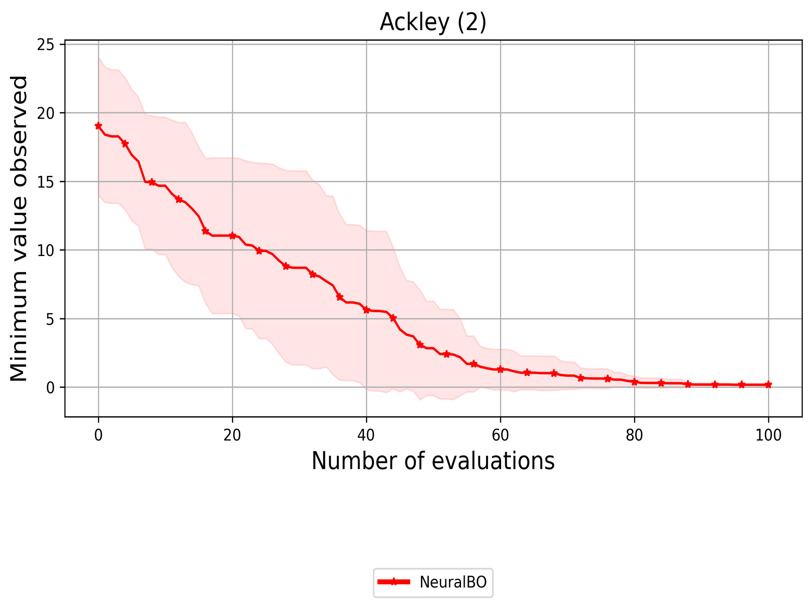

# An implementation of the paper "NeuralBO: A black-box optimization algorithm using deep neural networks". 
[Paper](https://www.sciencedirect.com/science/article/abs/pii/S0925231223008998)

## Introduction
This is an official implementation of paper "NeuralBO: A black-box optimization algorithm using deep neural networks" published at Neurocomputing journal.

### Dependency
- This work was tested with PyTorch 2.0.1, CUDA 11.7, python 3.11.5 
```
conda install pytorch cudatoolkit=11.7 -c pytorch
```
### Run demo
```
python demo.py -cfg <path_to_config_file>
``` 
### Customize your objective function
To define your new objective function, please consider the example Ackley function in utils/objective.py.

### Plot and visualization
To plot the minimum values found by the algorithm, use utils/plot_min_values.py
To plot the minimal points chosen at each optimization step, use utils/visualization.py

<div>
    
    
</div>

## Citation
Please consider citing this work in your publications if it helps your research.
```
@article{phan2023neuralbo,
  title={NeuralBO: A black-box optimization algorithm using deep neural networks},
  author={Phan-Trong, Dat and Tran-The, Hung and Gupta, Sunil},
  journal={Neurocomputing},
  volume={559},
  pages={126776},
  year={2023},
  publisher={Elsevier}
}
```
